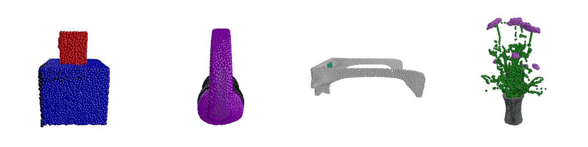

# Point·E

This is the official code and model release for [Point-E: A System for Generating 3D Point Clouds from Complex Prompts](https://arxiv.org/abs/2212.08751).

# Usage

Install with `pip install -e .`.

To get started with examples, see the following notebooks:

 * [image2pointcloud.ipynb](point_e/examples/image2pointcloud.ipynb) - sample a point cloud, conditioned on some example synthetic view images.
 * [text2pointcloud.ipynb](point_e/examples/text2pointcloud.ipynb) - use our small, worse quality pure text-to-3D model to produce 3D point clouds directly from text descriptions. This model's capabilities are limited, but it does understand some simple categories and colors.
 * [pointcloud2mesh.ipynb](point_e/examples/pointcloud2mesh.ipynb) - try our SDF regression model for producing meshes from point clouds.

For our P-FID and P-IS evaluation scripts, see:

 * [evaluate_pfid.py](point_e/evals/scripts/evaluate_pfid.py)
 * [evaluate_pis.py](point_e/evals/scripts/evaluate_pis.py)

For our Blender rendering code, see [blender_script.py](point_e/evals/scripts/blender_script.py)

# Samples

You can download the seed images and point clouds corresponding to the paper banner images [here](https://openaipublic.azureedge.net/main/point-e/banner_pcs.zip).

You can download the seed images used for COCO CLIP R-Precision evaluations [here](https://openaipublic.azureedge.net/main/point-e/coco_images.zip).
